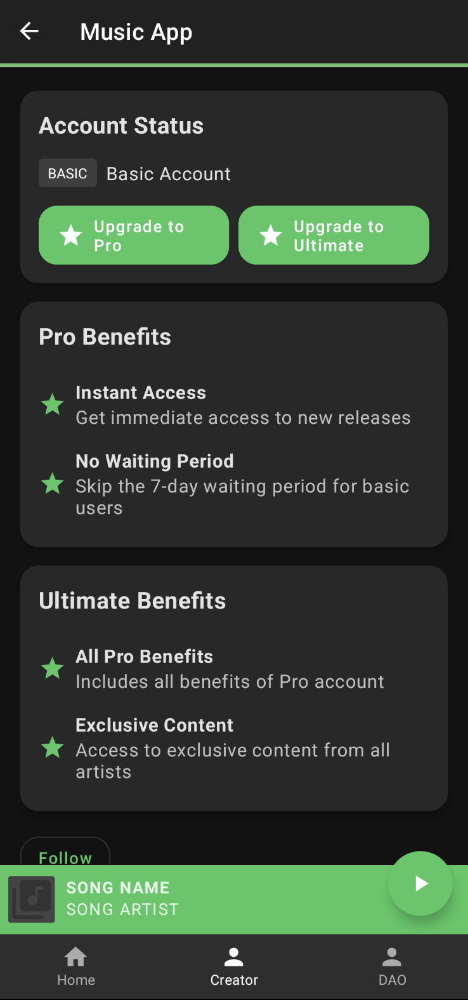
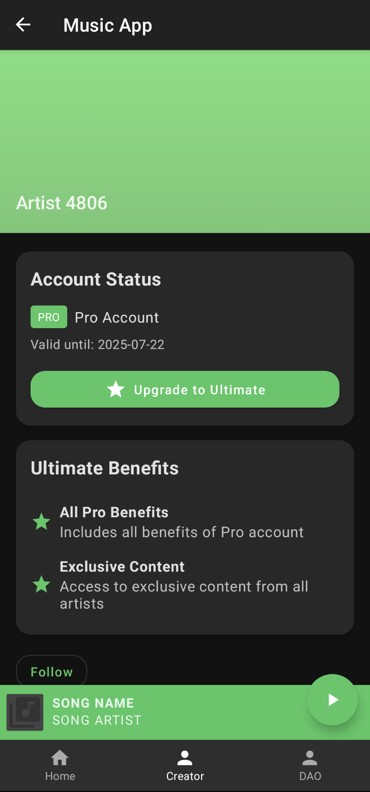
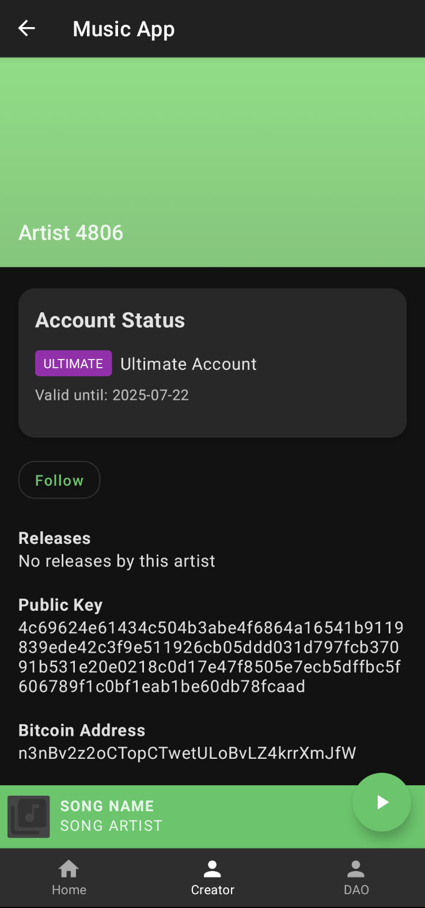
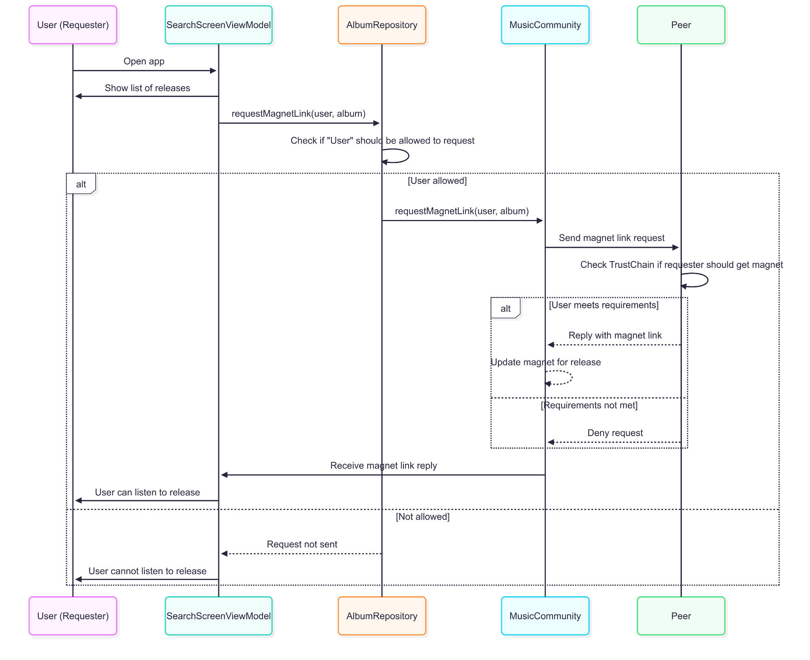
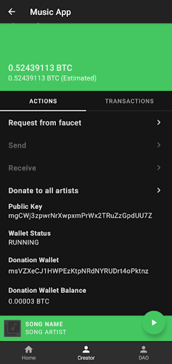

# TrustChain Super App 
This repository contains our improvements built on top of **MusicDAO**, an IPv8 app where users can share and discover tracks on the TrustChain. Track streaming, downloading, and seeking interactions are done using JLibTorrent.

The main features we implemented are:
- **User Account Hierarchy** - created different user account tiers with distinct access and benefits.
- **Donation Lottery System** - implemented a donation lottery where users donate to artists based on a weighted income function.

The following sections describe implementation details for each feature. Build instructions for this project can be found at the end of the README.

## User Account Hierarchy

### 1. Account Types
We provide the 3 following account tiers:

1. **Basic Account**: Default for all users. Access to all features, but new releases are delayed by 7 days.
2. **Pro Account**: Immediate access to new releases and premium features. Upgrade requires a Bitcoin payment (0.1 BTC/month).
3. **Ultimate Account**: Access to all Pro features plus exclusive content. Upgrade requires a higher Bitcoin payment (0.2 BTC/month).

### 2. Tier Verification with TrustChain

To prevent tier circumvention, all tier upgrades are recorded immutably on the **TrustChain**. Each block contains the user ID, tier, validity period, and is cryptographically signed.

Once written, a tier block is **permanent and tamper-proof**, preserving a secure and transparent history of all tier changes. For completeness, we list below the main advantages of this approach:
- **Tier Transparency**. Anyone can verify another user's tier by inspecting their TrustChain records. This mechanism forms the foundation of **access control** for tier-restricted features such as **exclusive or new releases**.
- **Block Validation**. Before being accepted on-chain, each tier block undergoes validation to ensure that all required fields are present and correct.
- **Payment Verification**. Tier upgrades are only processed **after confirmed Bitcoin payment**, ensuring legitimacy.
- **Public Key Authentication**. All actions are cryptographically tied to the user's **public key**, guaranteeing that only the rightful account owner can upgrade or downgrade their tier.


### 3. Upgrading to Pro or Ultimate

The following steps are executed when a user updates to `Pro`/`Ultimate`:
1. **Balance Check**: The app checks if their Bitcoin wallet has at least 0.1/0.2 BTC.
2. **Payment**: 0.1/0.2 BTC is sent to the global donation wallet. This is the same wallet in used in the Donation Lottery System.
3. **Block Creation**: On successful payment, a `PRO`/`ULTIMATE` tier block is created on TrustChain, valid for the purchased duration (1 month).
4. **UI Update**: The app updates the account status and refreshes the available releases.

The account tier validations for new/exclusive releases are performed only on the tier blocks whose whose `validFrom` is in the past and `validUntil` is in the future. This ensures that an expired `PRO`/`ULTIMATE` account is reverted back to `BASIC`.



### 4. Tier Access Checks when Requesting a Release

To ensure that account tiers cannot be bypassed (e.g., by directly requesting a magnet link from a peer), the system enforces access control at **two critical points**.

#### **1. Requester-Side Check**

When a user views a release, the app checks their tier and the release’s properties before even attempting to request the magnet link.

**How it works**:
- If the release is exclusive, only Ultimate users request the magnet link.
- For non-exclusive releases newer than 7 days, only Pro and Ultimate users request the magnet link. 
- For non-exclusive releases older than 7 days, all users request the magnet link.
- If the user does not meet the requirements for a certain release, the UI will not attempt to fetch the magnet link and will show an appropriate message (e.g., "Exclusive", "Waiting Period").

**Purpose**: Prevents the UI from leaking access to restricted content and avoids unnecessary network requests.

**Logic location**: `ReleaseScreenViewModel.kt` and `AlbumRepository.kt`

#### 2. Receiver-Side Check

When a peer receives a magnet link request, it checks the requester's tier (using the public key in the request) before sending the magnet link.

**How it works**:
- The peer looks up the requester's tier using TrustChain.
- If the requester is not eligible (e.g., not Ultimate for exclusive, not Pro or past delay for regular), the peer does not send the magnet link.
- This check is enforced even if the requester tries to bypass the UI or manipulate requests.

**Purpose**: Ensures that even if a user tampers with their client, they cannot obtain restricted content from honest peers.

**Logic location**: `MusicCommunity.kt` (`onMagnetRequest` and `checkUserAccess` methods)



### 5. Sharing Magnet Links P2P and not On-Chain

**Original Approach**  
In previous iterations of the **MusicDAO** app, magnet links for releases were stored **directly on the blockchain** (TrustChain) as part of the release metadata. This made it easy for any user to fetch the magnet link for any release by simply reading the blockchain.

**Security Problem**  
In the context of restricted releases, this approach had a critical flaw in terms of tier bypass risk. If a user could read the blockchain, they could access the magnet link for any release, regardless of their account tier. This made it impossible to properly enforce access control for exclusive or early-access content, since the magnet link (and thus the content) was publicly available to all.

**Solution: P2P Magnet Link Sharing**  
To solve this, we moved magnet link sharing to a **P2P**:
- The magnet link is **not stored on-chain**.
- When a user wants to access a release, they request the magnet link from peers who have it.
- Each peer enforces tier checks before sending the magnet link (see [Receiver-Side Check](#2-receiver-side-check) section).

**Security Benefits**
- **Enforced Access Control:** Even if a user tries to bypass the UI or manipulate requests, they cannot obtain the magnet link unless a peer verifies their tier and grants access.
- **No On-Chain Leakage:** The magnet link is never exposed on the blockchain, so it cannot be scraped or accessed by unauthorized users.
- **Defense in Depth:** Both the requesting client and the serving peer independently enforce tier restrictions, making circumvention virtually impossible for honest nodes.

### User Flows
To illustrate our feature's user flows, we provide the follwing screen recordings:
1. Full flow of accessing old, new, and exclusive releases, along with upgrading the account from Basic to Pro and subsequently to Ultimate: <a href="doc/musicdao/account_hierarchy/basic_to_pro_flow.mp4">video</a>
2. Full flow of accessing old, new, and exclusive releases when directly upgrading from Basic to Ultimate: <a href="doc/musicdao/account_hierarchy/basic_to_ultimate_flow.mp4">video</a>

## Donation Lottery System

### 1. Leader Mode and Role

The donation system is **leader-driven**, meaning only a designated device (the "leader") handles the **collection and redistribution of Bitcoin funds**.

- **Leader Mode Toggle**  
  The leader mode can be enabled or disabled from `MusicActivity.kt` from the `isManualLeader` flag. Only one leader should be active in a session.

- **Leader Responsibilities**
    - Collect donations from users.
    - Aggregate listening data from users.
    - Run the **weighted donation lottery** to distribute funds to artists proportionally.

### 2. Global Donation Wallet

The **Donation Wallet** is a shared Bitcoin wallet managed by the leader node:

- **Public Visibility**  
  Any user can view the balance of the donation wallet through the UI.

- **User Donations**  
  A “Donate” button in the UI allows users to contribute funds (BTC) to the global wallet.  


- **Wallet Access**  
  Managed internally via `DonationWalletManager`, which interfaces with the underlying BitcoinJ wallet.


### 3. Sending Listening History to the Leader

Each user tracks how often they listen to each artist locally. Periodically, users send their **listen count history** to the leader in the form:

```kotlin
{"artistId1":12, "artistId2":3, ...}
```

The leader collects these values and uses them to determine donation distributions.


### 4. Weighted Lottery Distribution

The leader runs the **weighted donation lottery** using:
```kotlin
donationWalletManager.runWeightedLottery(listenCounts)
```


- Uses cumulative listen data from all users.
- Calculates how much each artist should receive based on listen counts using `createBatchSpendExactWeightedBetter(...)` in `WalletService`.
- Creates and broadcast the Bitcoin transaction.

**Automatic Payouts on Intervals**  
The `DonationWalletManager` automatically executes the weighted lottery at **fixed time intervals** (e.g., every 10 seconds).  
These intervals are **configurable**, allowing fine-tuned control over donation timing.

### 5. How The Donation Works

The donation is designed for fair and optimized distribution:

#### Phase One: Equal Distribution (Legacy)
The earliest implementation used `runLottery()` which split the total wallet balance **equally among all artists**, regardless of their listen count.

- Simple but unfair: artists with more listens received the same amount as those with fewer.
- Still useful for basic scenarios or testing purposes.

#### Phase Two: Weighted Distribution

##### Naive Approach: `createBatchSpendExactWeighted` (Legacy)
- Calculates a payout per artist proportional to their listen count (relative weight).
- Repeats payout reduction if the estimated fee exceeds available balance.
- Filters out artists whose share is too small.
- Drawback: runs in **linear time with retries**, which is inefficient and slow as the number of artists grows.

##### Optimized Approach: `createBatchSpendExactWeightedBetter`
This refined version is faster and smarter. It ensures optimal distribution while keeping fees manageable:

- **Uses binary search to**:
  - Determine the maximum number of artists that can be paid
  - Reduce each artist's payout incrementally until the transaction fits within the wallet balance and fee buffer
- **Skips underfunded artists**:
  - Any artist whose calculated share falls below a defined minimum (e.g., 5000 satoshis) is excluded
- **Final result**:
  - A complete, fee-compliant Bitcoin `Transaction`
  - A map of artists who were paid and how much they received
  - A map of artists who were skipped due to low share or insufficient funds

This approach significantly improves performance and scalability, especially when dealing with many artists and a limited donation pool.


### 6. Fee Estimation

Located in `WalletService`:
```kotlin
fun estimateFee(tx: Transaction): Long
```
- Estimates Bitcoin transaction fees based on actual UTXO selection
- Uses `wallet().completeTx(request)` to sign the transaction without broadcasting it
- **Throws an error** if the wallet doesn’t have enough funds to cover the transaction

### 6. Demo
To illustrate how our feature works, we provide the follwing screen recordings:
1. The donation founds are given to a single user: <a href="doc/musicdao/donation_lottery/lottery_with_1_user.mp4">video</a>
2. The donation founds are split between two users: <a href="doc/musicdao/donation_lottery/lottery_with_2_users.mp4">video</a>


## Build Instructions

### Clone
Clone the repository **including the submodule** with the following command:
```
git clone --recurse-submodules <URL>
```

If you have already cloned the repository and forgot to include the `--recurse-submodules` flag, you can initialize the submodule with the following command:
```
git submodule update --init --recursive
```
You can also update the submodule with this command.

### Build
If you want to build an APK, run the following command:
```
./gradlew :app:assembleDebug
```
The resulting APK will be stored in `app/build/outputs/apk/debug/app-debug.apk`.

### Install
You can also build and automatically install the app on all connected Android devices with a single command:
```
./gradlew :app:installDebug
```
*Note: It is required to have an Android device connected with USB debugging enabled before running this command.*

### Check
Run the Gradle check task to verify that the project is correctly set up and that tests pass:
```
./gradlew check
```
*Note: this task is also run on the CI, so ensure that it passes before making a PR.*  

### Tests
Run unit tests:
```
./gradlew test
```

Run instrumented tests:
```
./gradlew connectedAndroidTest
```

### Code style
[Ktlint](https://ktlint.github.io/) is used to enforce a consistent code style across the whole project. It is recommended to install the [ktlint plugin](https://plugins.jetbrains.com/plugin/15057-ktlint) for your IDE to get real-time feedback.

Check code style:
```
./gradlew ktlintCheck
```

Apply linter:
```
./gradlew ktlintFormat
```
